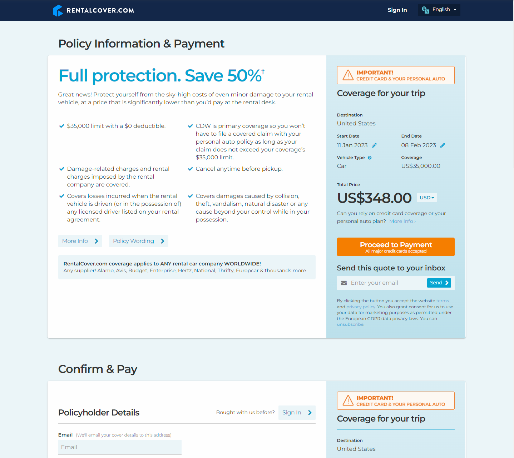
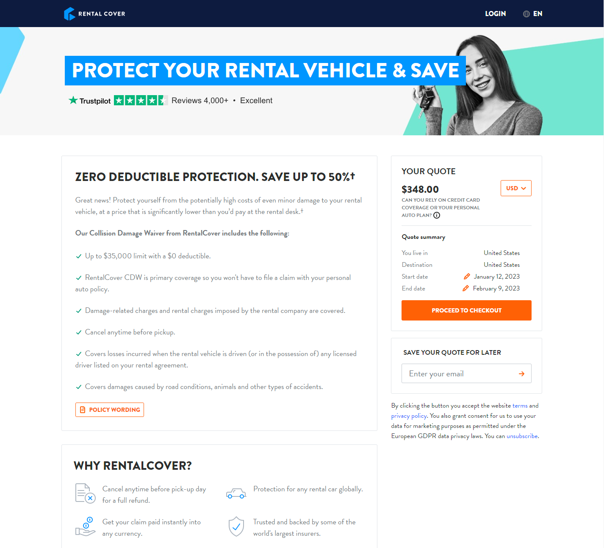

# Web Acceptance Tests
> A sample web automation framework for the https://www.rentalcover.com/en/ website built on <b>JAVA</b> using <b>Selenium</b> and <b>TestNG</b>

## Table of contents
* [Prerequisites and Assumptions](#prerequisites-and-assumptions)
* [Setup and Run](#setup-and-run)
* [Issues found](#issues-found)

## Prerequisites and Assumptions
* The below steps cater to a machine running Windows
* These tests were designed for and run on **Google Chrome** browser - https://www.google.com.au/intl/en_au/chrome/
* The latest JAVA JDK should be installed and JAVA_HOME environment variable should be set - https://www.oracle.com/au/java/technologies/javase-downloads.html
* The latest Maven binary should be downloaded and added to system path - https://maven.apache.org/download.cgi
* The steps have been written for IntelliJ IDEA and may be slightly different for other IDEs - https://www.jetbrains.com/idea/download/#section=windows

##  Setup and Run
* Check out the code and open project root folder **\web.acceptancetests\\** in IntelliJ IDE
* Build the project and download Maven dependencies
* The target url(url), country of rental, country of residence and vehicle types can be configured in the **RentalCover.xml TestNG file**  
* To run the project, right click on **\web.acceptancetests\acceptance-tests\TestNGFiles\RentalCover.xml</b> and select **Run**
* In order to enable reporting, edit run configuration and in the **Listeners** tab, make sure **Use default reporters** is checked
* After the run, reports can be found in **\web.acceptancetests\acceptance-tests\test-output\\**
* The timestamped screenshots from the run can be found in **\web.acceptancetests\acceptance-tests\Screenshots\\**

##  Issues found
* The behaviour of the page when a quote is requested with the given parameters is unpredictable. Sometimes, it loads the correct  **Policy Information & Payment** page and sometimes it loads a completely different **Your Quote** page
  
**Expected Result**

**Intermittent Bug**
